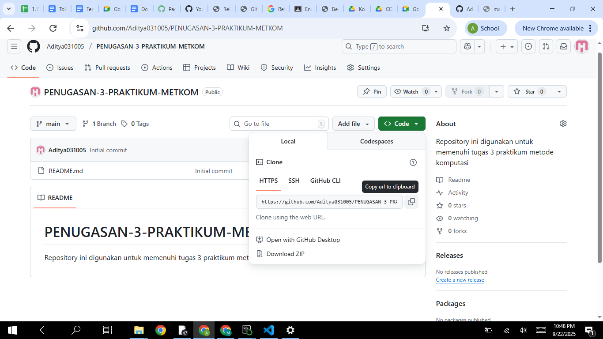
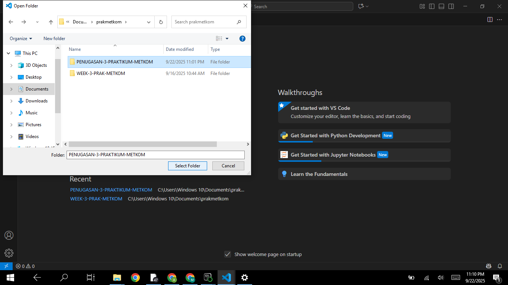

**LANGKAH - LANGKAH MEMBUAT REPOSITORY :**
1. Buka www.github.com lalu masuk ke classroom yang telah ada.

2. Klik tanda "+" dibagian kanan atas kemudian klik "New Repository".

3. Akan muncul tampilan seperti dibawah ini, isikan bagian Repository name, Description, dan aktifkan READ ME.

4. Jika semua sudah dilakukan klik tombol "Create repository".

5. Disini akan muncul repository yang telah anda buat. Selesai.

**LANGKAH - LANGKAH MENAMBAHKAN REPOSITORY KE FILE UNTUK DIMASUKKAN KE DALAM VSCODE :**
1. Buka anaconda prompt lalu ketik "dir" akan muncul tampilan seperti dibawah ini.

2. Pilih tempat dimana folder penyimpanan berada misalkan documents,download, dsb. dengan cara ketikkan *cd "Tempat Folder Berada"*.

3. Kemudian pilih folder penyimpanan yang akan digunakan dengan cara ketikkan *cd "Nama Folder"*.

4. Kembali ke Github lalu klik "code" yang berwarna hijau kemudian copy link repositorynya.

5. Selanjutnya silahkan kembali lagi ke anaconda prompt lalu ketikkan *git clone* dan paste link repository yang tadi.

6. Jika sudah, ketik "dir" dan pilih folder repository yang telah dibuat dengan cara ketikkan *cd Nama Repository*.

7. Lalu ketikkan *git config --global user.email "email yang digunakan"*.

8. Lalu ketikkan *git init*. Selesai.

**LANGKAH - LANGKAH MEMBUAT README :**
1. Buka VSCode dan klik menu file di pojok kiri atas lalu klik "Open Folder".

2. Cari dan pilih file folder repository yang sudah dibuat dengan cara klik file fordernya kemudian klik "Select Folder".

3. Selanjutnya klik README.md dan isi profil READ ME sesuai yang diinginkan.

4. Kemudian simpan file dengan cara klik menu file di pojok kiri atas pilih "save" atau bisa langsung menggunakan shortcut "ctrl+s". Selesai.

**LANGKAH - LANGKAH MEMBUAT MARKDOWN DAN MENAMBAHKAN GAMBAR :**
1. Klik "New File" dan beri nama pada file markdown tersebut.

2. Copy gambar ke folder repository yang telah dibuat.

3. Untuk menambahkan gambar kembali ke VSCODE kemudian ketikkan **
4. Preview dengan ctrl+shift+v untuk melihat gambar.

5. Jika sudah simpan file dengan cara klik menu file di pojok kiri atas pilih "save" atau bisa langsung menggunakan shortcut "ctrl+s".
6. Selanjutnya buka anaconda prompt kembali, ketik 'git add .' . Lalu ketik git commit -m "link code repository". dan yang terakhir ketik git push.

7. Buka repository GitHub dan periksa apakah sudah terupload atau belum. Selesai.

